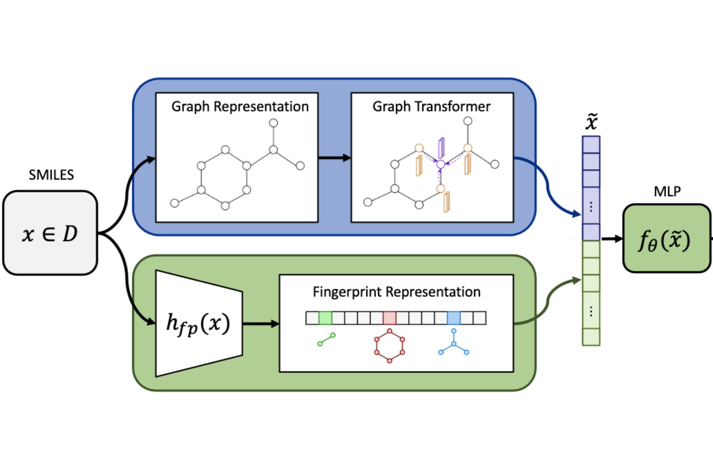
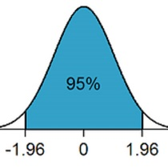
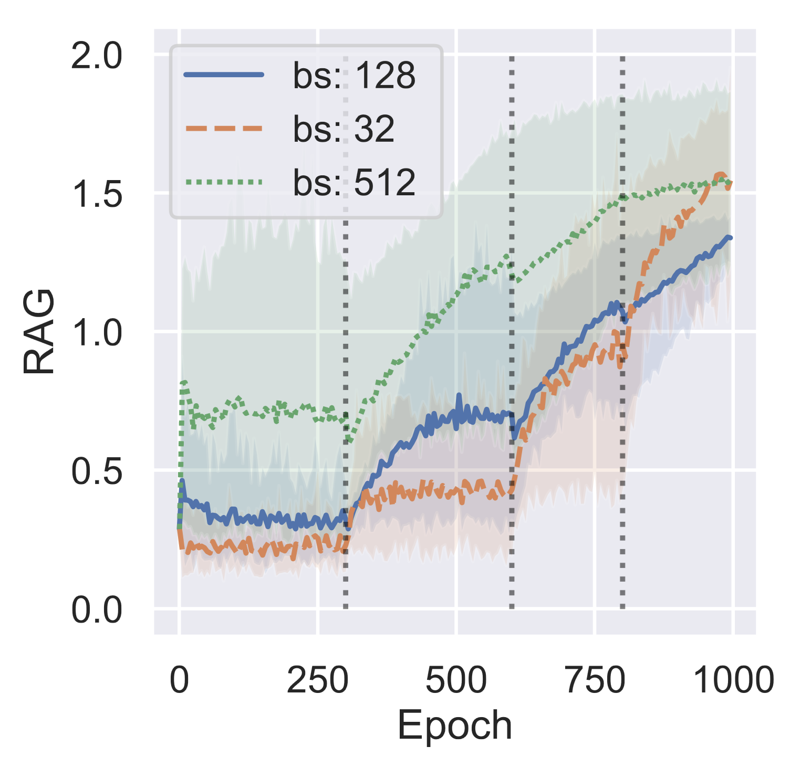
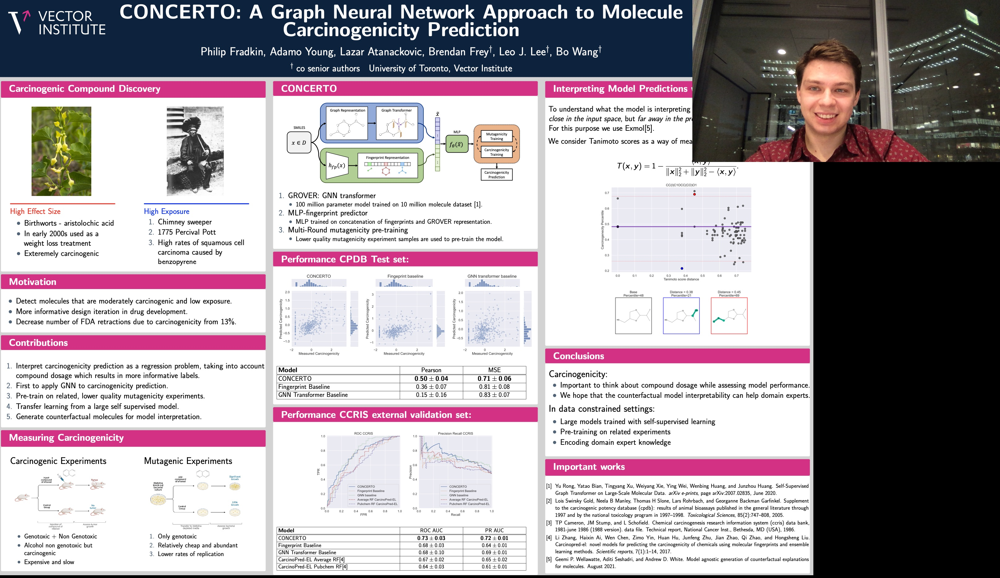
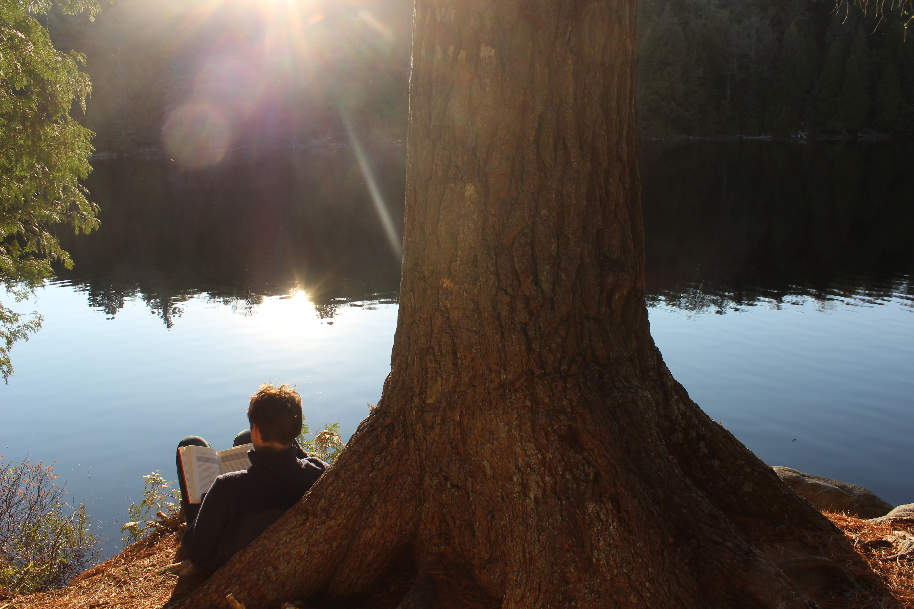

## About me:

I’m a PhD student at the university of Toronto working to create advances at the intersection of machine learning and genomics. I am passionate about the subject because the consequences of discovery are so significant - biology is all around us and yet we understand so little of it.

Prior to starting my PhD I worked as a computational biologist at
Deep Genomcs where I worked on translating foundational research in machine learning and genomics into pre-clinical applications.

My PhD projects are in the areas of self-supervised contrastive training, and data efficient learning for biological sequences. I am broadly curious and would love to discuss new and ongoing projects.

--- 
--- 

## Scince Communication

    <a href="./science/concerto_2022.html">
        
        <h3>June 2022: Concerto</h3>
        
I'd like to give a brief explanation for the motivation and the work done in our publication Concerto: a graph neural network approach for molecule carcinogenicity prediction.

    </a>

    <a href="https://open.spotify.com/episode/1aRzadwiHPS16DpUEdYlBb?si=4250cb59742f491c">
        
        <h3>February 2020: Podcast</h3>
        
We recorded a podcast with my friend Erik Drysdal covering advancements in genomics over the last 20 years, state of predictive system in molecular biology, and a little bit of personal history!

    </a>

## Science Timeline

    <a href="https://icml-compbio.github.io/">
        
        <h3>July 2023 - IsoCLR</h3>
        
 I presented my latest project: "Splicing Up Your Predictions with RNA Contrastive Learning" at the ICML Computational-biology Workshop.

    </a>

    <a href="https://openreview.net/forum?id=-b3MEzI6N3">
        
        <h3>July 2022 - RAG</h3>
        
Presented Robustness to Adversarial gradients at ICML Pre-training Workshop. We evaluate minima sharpness by taking an adversarial step and measure the change in loss.

    </a>

    <a href="https://academic.oup.com/bioinformatics/article/38/Supplement_1/i84/6617525">
        
        <h3>June 2022 - Concerto</h3>
        
 Our publication was accepted to Bioinformatics and I got to present our work at ISMB2022.

    </a>

    <a href="https://www.youtube.com/watch?v=rwaj1RYME2A&amp;t=4880s">
        
        <h3>November 2021 - MLCB Oral </h3>
        
 Our Concerto project was accepted as an oral presentation at MLCB 2021. In it we predict molecular carcinogenicity using transfer-learning and pre-training. 

    </a>

    <a href="https://psi.toronto.edu/people/">
        
        <h3>September 2020 - PhD begins! </h3>
        
 I started my PhD (in the middle of Covid) at University of Toronto with Brendan Frey and Bo Wang! 

    </a>

--- 
--- 

## Misc

    <a href="/things_im_reading.html">
        
        <h3>Things I'm Reading</h3>
        
A collection of articles, books, and papers I'm currently reading.

    </a>

