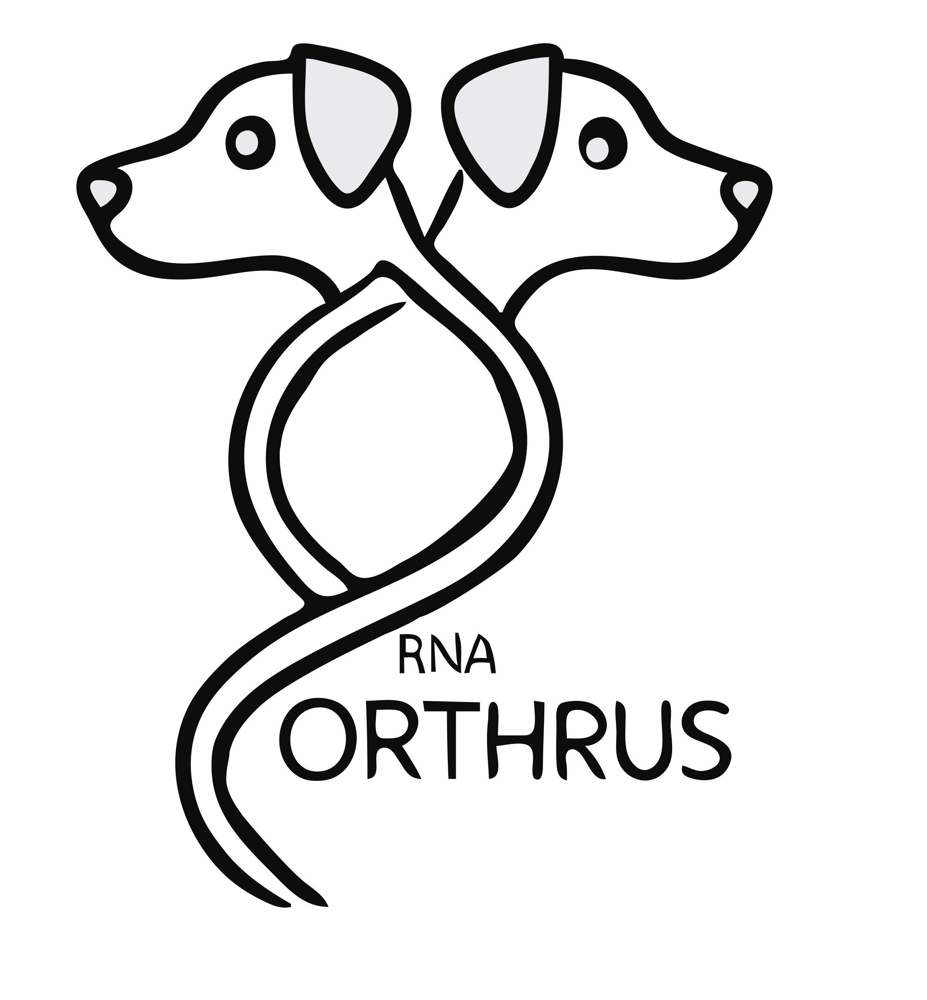
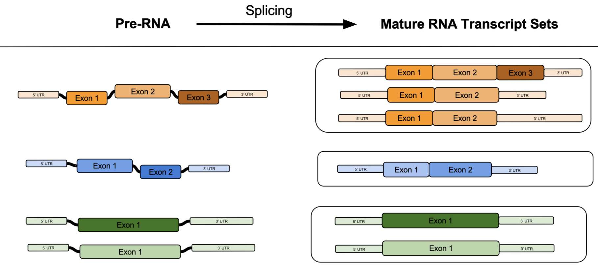

## About me:

I’m a PhD student at the university of Toronto working to create advances at the intersection of machine learning and genomics. I am passionate about the subject because the consequences of discovery are so significant - biology is all around us and yet we understand so little of it.

Prior to starting my PhD I worked as a computational biologist at
Deep Genomics where I worked on translating foundational research in machine learning and genomics into pre-clinical applications.

My PhD projects are in the areas of self-supervised contrastive training, and data efficient learning for biological sequences. I am broadly curious and would love to discuss new and ongoing projects.

--- 
--- 

## Science Communication

    <a href="./science/orthrus.html">
        <h3>Orthrus: Towards Evolutionary and Functional RNA Foundation Models</h3>
        
        
In this work we train a Mamba based model to learn mature mRNA representations using contrastive learning. Our augmentations consist of orthologous, and alternatively spliced transcripts.

    </a>

    <a href="https://www.recursion.com/news/learning-the-effects-of-molecules-on-cells-with-molphenix">
        <h3>MolPhenix or How Molecules Impact Cells: Unlocking Contrastive PhenoMolecular Retrieval</h3>
        
        
We worked with folks from Recursion and Valence to create MolPhenix! It's a novel approach for learning the effects of concentration and molecules on cell morphology using large-scale phenomics data. To do that we innovate on the contrastive learning objective with the S2L loss.

    </a>

    <a href="./science/isoclr_2023.html">
        <h3>IsoCLR: Splicing up your predictions with RNA contrastive learning</h3>
        
        
This is a small explainer on IsoCLR or Splicing Up Your Predictions with RNA Contrastive Learning!

    </a>

    <a href="./science/concerto_2022.html">
        <h3>Concerto: A graph neural network approach for molecule carcinogenicity prediction</h3>
        
        
I'd like to give a brief explanation for the motivation and the work done in our publication Concerto: a graph neural network approach for molecule carcinogenicity prediction.

    </a>

    <a href="https://open.spotify.com/episode/1aRzadwiHPS16DpUEdYlBb?si=4250cb59742f491c">
        <h3>I was a guest on a podcast: Statistically Insignificant</h3>
        
        
We recorded a podcast with my friend Erik Drysdale covering advancements in genomics over the last 20 years, state of predictive system in molecular biology, and a little bit of personal history!

    </a>

--- 
--- 

## Research Timeline

    <a href="http://www.arxiv.org/abs/2409.08302">
        
        <h3>December 2024 - MolPhenix</h3>
        
Today, we're excited to introduce MolPhenix, a foundation model that can predict the effect of any given molecule and concentration pair on phenotypic cell assays and cell morphology. Our paper was accepted to the NeurIPS 2024 main track!

    </a>

    <a href="https://arxiv.org/abs/2310.08738/">
        
        <h3>July 2023 - IsoCLR</h3>
        
 I presented my latest project: "Splicing Up Your Predictions with RNA Contrastive Learning" at the ICML Computational-biology Workshop.

    </a>

    <a href="https://openreview.net/forum?id=-b3MEzI6N3">
        
        <h3>July 2022 - RAG</h3>
        
Presented Robustness to Adversarial gradients at ICML Pre-training Workshop. We evaluate minima sharpness by taking an adversarial step and measure the change in loss.

    </a>

    <a href="https://academic.oup.com/bioinformatics/article/38/Supplement_1/i84/6617525">
        
        <h3>June 2022 - Concerto</h3>
        
 Our publication was accepted to Bioinformatics and I got to present our work at ISMB2022.

    </a>

    <a href="https://www.youtube.com/watch?v=rwaj1RYME2A&amp;t=4880s">
        
        <h3>November 2021 - MLCB Oral </h3>
        
 Our Concerto project was accepted as an oral presentation at MLCB 2021. In it we predict molecular carcinogenicity using transfer-learning and pre-training. 

    </a>

    <a href="https://psi.toronto.edu/people/">
        
        <h3>September 2020 - PhD begins! </h3>
        
 I started my PhD at University of Toronto with Brendan Frey and Bo Wang! 

    </a>

--- 
--- 

## Misc

    <a href="/things_im_reading.html">
        
        <h3>Things I'm Reading</h3>
        
Amidst all the science and progress I think it's important to remain a functional human being so I try to read things from time to time. Here is a list of thing I've recently read for posterity.

    </a>

