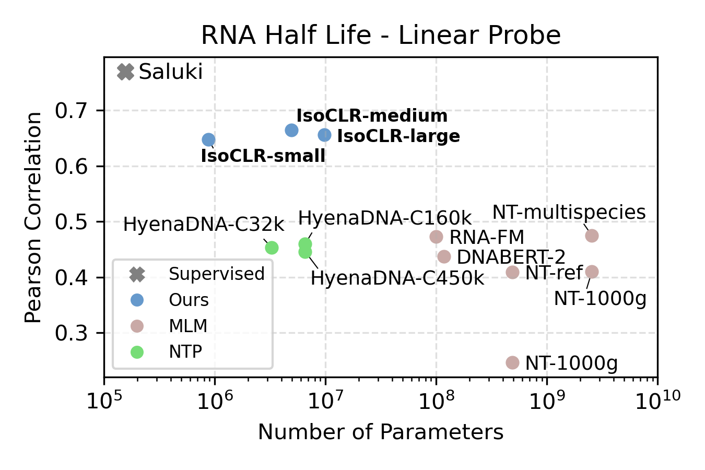
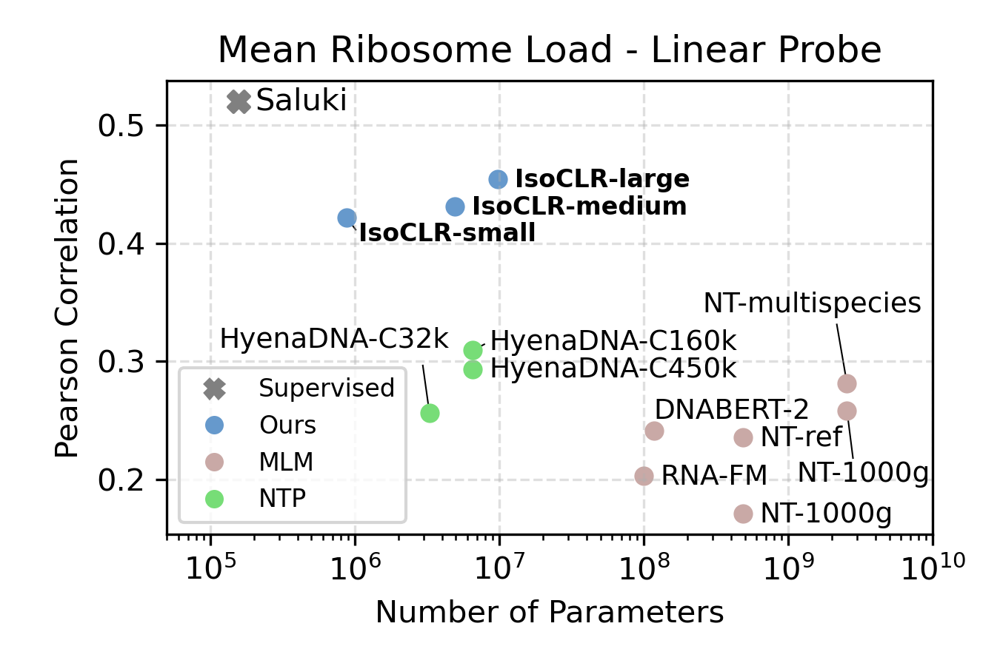

## IsoCLR: Splicing up your predictions with RNA contrastive learning

    🔗
    <a href="https://arxiv.org/abs/2310.08738">
        <h3>Link To Paper</h3>
        

    </a>

    

<!-- 

    🔗
    <a href="https://github.com/bowang-lab/CONCERTO">
        <h3>Link To Code Base</h3>
        

    </a>

 -->

### What is IsoCLR?

In our work “Splicing up your predictions with RNA contrastive learning”, we present a new self-supervised learning objective for mature spliced RNA. We utilize a contrastive loss to minimize the distance between functionally similar RNAs that have distinct sequences. This is conceptually similar to [SimCLR](https://arxiv.org/abs/2002.05709) in which the objective is to minimize the distance between augmented images (think cropping, rotation, recoloration). But you might ask: while there are  clear semantic content preservation operations in images, how can we augment RNA while preserving its semantic content?

In IsoCLR, we propose that [alternative splicing](https://en.wikipedia.org/wiki/Alternative_splicing)and [gene duplication](https://en.wikipedia.org/wiki/Gene_duplication) can be used as a source of sequence augmentation that largely preserves gene function. Our hypothesis is that RNAs prpoduced from the same gene will more often have the same function than RNAs from different genes. There are known cases of RNA isoforms from the same gene having different functions, but we argue that our approach is able to tolerate certain amount of noise. RNA splicing and gene duplication have been meticulously studied by biologists for the past 30 years and have been usually discussed in the [context of disease](https://www.science.org/doi/10.1126/science.1250127). In this work we view RNA sequences generated by these processes as diversity generating mechanisms instead.

We show that embeddings generated through this contrastive objective outperform models trained with a reconstruction objective such as masked language modelling or next token prediction. IsoCLR is able to outperform models that are two orders of magnitude larger in terms of parameter count (!). In addition, we demonstrate that IsoCLR has good performance in the low data regime which opens up possibilities for training models on more expensive and time consuming experiments.

### Inspirations and augmentations

The work is inspired by SimCLR, a work from computer vision, in which models are trained by utilizing augmentations of the same sample. After augmenting the images with a semantically preserving operation such as rotation, the images are embedded in a latent space using a model. The contrastive loss then forces positive pairs of the same original image to be pushed towards each other while pushing apart other samples. This approach works remarkably well.

In our work, we build on this concept by applying it to mature RNA transcript sequences. RNA is first transcribed from genes in DNA, and can then be alternatively spliced to create variations in the overall sequence. More often than not, key parts of the sequence are preserved while variable regions like "cassette exons" are either included or excluded. In addition there is variability in the untranslated regions of the RNA which regulates RNA localization, expression, and translatability. We also utilize gene duplications, another process with which diversity is introduced in RNA genetic sequence.

### So does it work?

    
    

Yes! We evaluated the model on two RNA regulatory processes that regulate protein production: RNA half-life and mean ribosome load. We focused our evaluation on linear probing to compare the quality of the representation against other self-supervised methods. We find that IsoCLR consistently outperformed methods that use a reconstruction objective like masked language modeling and next token prediction. We evaluate against a variety of methods that were trained on human and genomes of other species.

In addition, we found that pre-training improved performance in the low data regime. We hypothesized that this is because IsoCLR learns meaningful latent representations, simplifying the supervised training on the downstream task.

    
    

To validate that the latent representations learn semantically meaningful information, we perform dimensionality reduction on the latent space. Below is a t-sne of the latent representation across RNA sequences corresponding to different gene ontologies. IsoCLR was never trained on GO terms and learns GO stratification as an indirect result of our training objective. To validate that we are not just picking up spurious spatial features, we perform linear probing experiments on top 10 most common GO labels from the Molecular Function GO tree (from a single hierarchical level).

 

    
    
    

### Theories for why it works better than MLM

We argue that the reason IsoCLR outperforms reconstruction based self-supervised methods is because of a stronger inductive bias. We use our knowledge of RNA biology to encode the structure of the model latent space. So how come next token prediction is so incredibly effective in language, but underperforms when trained on DNA?

The human genome consists of 20,000 protein coding genes that are under negative selection. This means that mutations occur there relatively rarely, making it difficult to generate diverse sequences through acquisition of new human genomes. However, the other 98% of the genome which is under much lower negative selection, with mutations there being of little consequence on an organism's fitness. The sequences from the intergenic regions often contain low information, resulting in a small percentage of the overall dataset being informative. We note that for dataset improvement scaling across a higher number of species remains a viable strategy, since it allows us to capture more informative regions that are vital for organism survival.

### Isn't splicing like... Important?

Splicing is very important! Approximately 15% of human disease is caused by mistakes in splicing regulatory code. In this work, we utilize naturally occurring alternative splicing as a diversity generating mechanism. The hypothesis is that RNAs generated through splicing and gene duplication are functionally similar more often than RNAs from different genes. I realize that this is a different interpretation of splicing than a lot of people are familiar with, so if you want to chat about this don't hesitate to reach out and I would be happy to hear your thoughts!

### So why do we even care about RNA?

For those less familiar with RNA, there is currently a biotech revolution underway. New RNA-based modalities are breaking into the market promising clearer mechanisms of action and lower drug approval failure rates. Deep learning models have played an important role in other domains, however, in genomics masked language modeling has had mixed success. In this work we propose an alternate self-supervised learning approach based on biological knowledge for defining augmentations.

